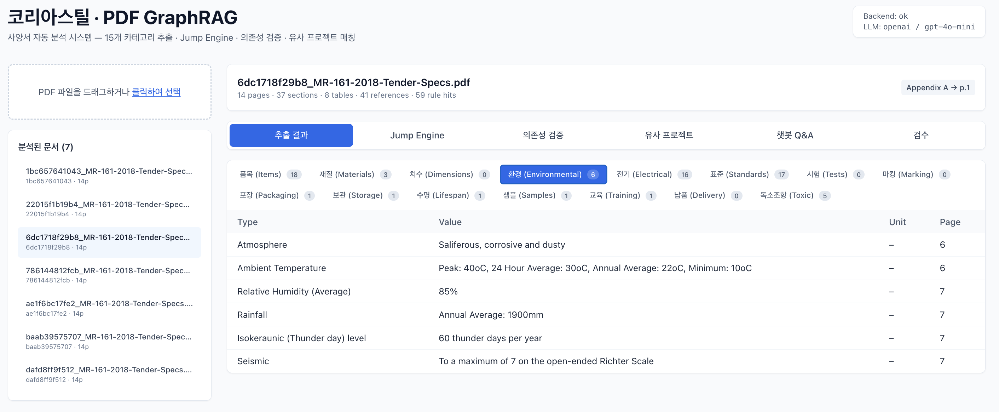
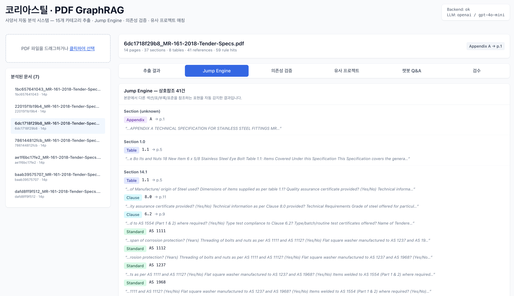
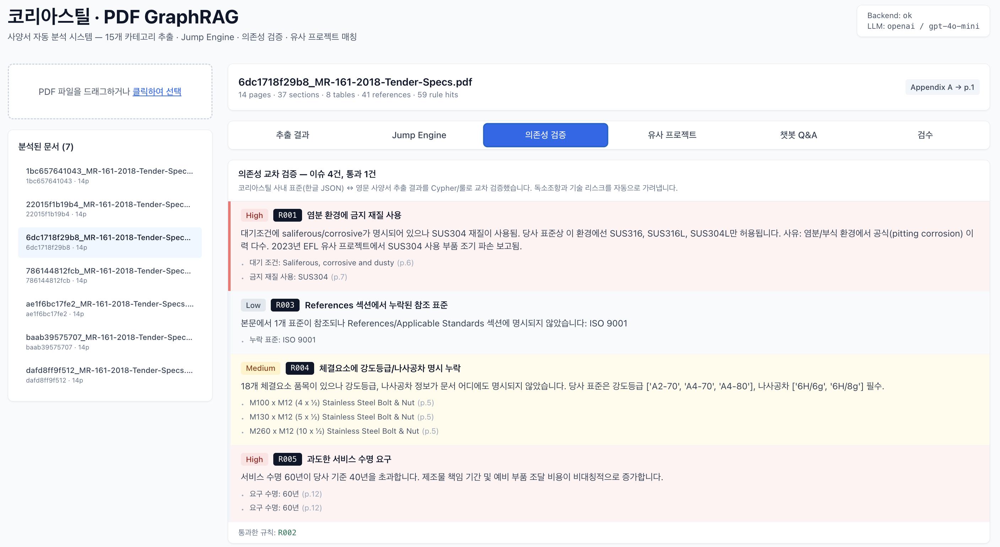
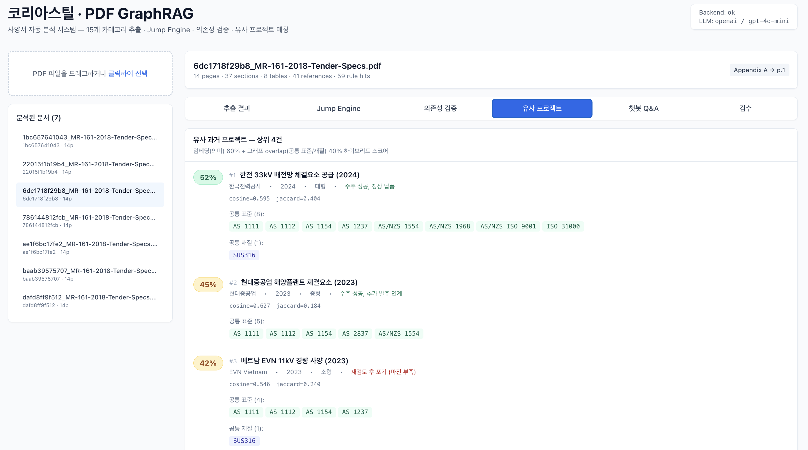
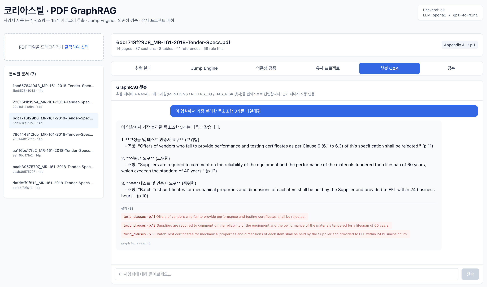
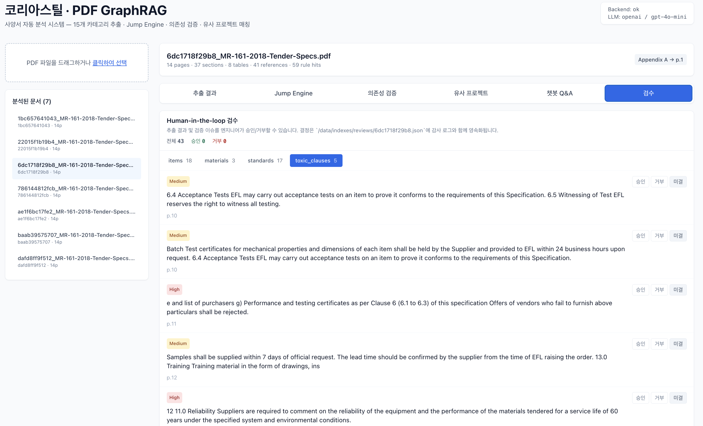

# 코리아스틸 PDF GraphRAG

비정형 PDF 사양서(PTS, Tender Specs)를 자동 분석하여
**사양 추출 · 의존성 교차 검증 · 독소조항 탐지 · 유사 프로젝트 매칭 · GraphRAG 자연어 질의응답 · HITL 검수**를 수행하는 **완전 폐쇄망** 온프레미스 AI 시스템.


---

## 핵심 기능 (6종)

| # | 기능 | 경로 |
|---|---|---|
| 1 | **15개 카테고리 구조화 추출** — 3-Tier 파이프라인 (룰 + LLM) | 추출 결과 탭 |
| 2 | **Jump Engine** — "Appendix/Table/Clause/AS 표준" 자동 참조 해결 | Jump Engine 탭 |
| 3 | **의존성 교차 검증** — 한글 사내 표준(R001~R005) ↔ 영문 PDF | 의존성 검증 탭 |
| 4 | **유사 프로젝트 매칭** — 하이브리드(임베딩 60% + 그래프 40%) | 유사 프로젝트 탭 |
| 5 | **GraphRAG Q&A** — Cypher 사실 주입 + 근거 페이지 인용 | 챗봇 Q&A 탭 |
| 6 | **Human-in-the-loop 검수** — 엔티티별 승인/거부 감사 로그 | 검수 탭 |

---

## 화면

실제 MR-161 PDF를 업로드한 뒤의 프론트엔드 캡처. 좌측 사이드바에서 업로더/문서 목록을 공유하고, 상단 6개 탭이 아래 6개 기능을 각각 담당합니다.

### 1. 추출 결과 대시보드


15개 카테고리 추출 결과를 탭으로 구분해 표시. 스크린샷은 Items 18개(Table 1.1 전체) + 독소조항 5건이 동시에 탐지된 상태 — Tier 1 룰 기반 결과와 Tier 2 LLM 결과가 하나의 `ExtractedDocument`로 병합된다.

### 2. Jump Engine — 참조 해결


본문의 "see Table 3.2", "as per AS/NZS 1252", "refer to Appendix A" 같은 표현을 자동 탐지해 **원문 페이지 → 참조 대상 페이지**로 연결. 참조 문맥 스니펫이 함께 노출되어 근거 추적이 쉬워진다.

### 3. 의존성 교차 검증


사내 한글 표준 JSON(`R001~R005`)을 PDF 추출 결과와 대조한 결과. 스크린샷은 **R001 염분+SUS304 고위험, R003 표준 선언 누락, R004 체결요소 속성 누락, R005 서비스 수명 60년 초과** 4개 이슈가 심각도 배지와 함께 표시된 상태.

### 4. 유사 프로젝트 매칭


임베딩(60%) + 그래프 공통 표준/재질(40%) 하이브리드 스코어로 과거 프로젝트 4건 중 유사도 상위를 정렬. **한전 33kV 52.4%** — 공통 표준 8개와 SUS316 공유가 근거로 제시되어 견적 레퍼런스로 재활용 가능.

### 5. GraphRAG 챗봇 Q&A


Neo4j에서 미리 뽑은 사실(섹션·표준·독소조항)을 LLM 컨텍스트로 주입해 근거 페이지와 함께 답변. 프리셋 질문 3종("독소조항 3개", "Saliferous 재질 안전성", "Table 1.1 품목 개수")으로 즉시 시연 가능.

### 6. Human-in-the-loop 검수


추출된 엔티티를 카테고리별로 열람하며 **승인/거부/보류** 결정을 기록. 결정은 `data/indexes/reviews/{doc_id}.json`에 누적 저장되어 감사 로그로 재활용.

---

## 빠른 시작

```bash
cp .env.example .env
# .env에 OPENAI_API_KEY 입력

docker compose up --build
```

서비스:
- Frontend: http://localhost:3000
- Backend API: http://localhost:8000/docs
- Neo4j Browser: http://localhost:7474 (user: `neo4j`)

샘플 PDF는 `data/samples/MR-161-2018-Tender-Specs.pdf` (Energy Fiji 14페이지 Stainless Steel Fittings 입찰 사양서) — 바로 드래그해서 테스트 가능.

---

## 아키텍처

```
PDF ──► [Parsing] ──► [Tier 1 Rules] ──┐
                                        ├──► [ExtractedDocument (15 categories)]
          [Tier 2 LLM (structured)] ────┘
                                        │
                            ┌───────────┼───────────┐
                            ▼           ▼           ▼
                      Jump Engine   Validation  Similarity
                      (REFERS_TO)   (R001~R005) (Embedding + Graph)
                            │           │           │
                            ▼           ▼           ▼
                       Neo4j Graph + FAISS-ready store
                            │
                            ▼
                       GraphRAG Q&A + HITL Review
```

- **LLM 추상화**: 데모는 OpenAI, 프로덕션은 vLLM (`LLM_BACKEND` 환경변수 한 줄로 전환) — 상세 [`docs/llm_abstraction.md`](./docs/llm_abstraction.md)
- **데이터 모델**: Neo4j (노드 9종, 엣지 5종) + 사내 표준 한글 JSON — 상세 [`docs/architecture.md#데이터-모델`](./docs/architecture.md)

---

## 벤치마크 (MR-161 기준)

| 단계 | 시간 |
|---|---|
| 추출 전체 (14p) | 49s |
| 의존성 검증 | 0.04s |
| 유사 매칭 | 1.9s |
| 챗봇 답변 | 1.5 ~ 5.5s |

- 추출 정확도: Items 18/18, Standards 17, Toxic 5, Validation 이슈 4/5 룰 발동
- 유사 프로젝트 #1: **한전 33kV 52.4%** (공통 표준 8 + SUS316)

상세 [`docs/benchmarks.md`](./docs/benchmarks.md).

---

## 디렉터리

```
backend/   FastAPI + Python 파이프라인 + LLM/Embedding 추상화
frontend/  React + Vite + TS + Tailwind CSS
data/
  samples/            테스트용 PDF
  standards/          코리아스틸 사내 표준 (한글 JSON, R001~R005 규칙 포함)
  past_projects/      synthetic 과거 프로젝트 4건 (유사 매칭용)
docs/                 제안서 첨부용 설계서
tests/                pytest (Jump Engine 단위 테스트)
```

---

## 테스트

```bash
docker exec pdfgraph-backend pip install -q pytest pytest-asyncio
docker exec pdfgraph-backend python -m pytest tests/ -v
```

현재 5/5 테스트 통과 (Jump Engine: table/appendix/standard/dedup/context).

---

## 폐쇄망 전환

코드 수정 없이 환경변수만 변경:

```bash
# .env
LLM_BACKEND=vllm
VLLM_BASE_URL=http://vllm:8000/v1
VLLM_MODEL=qwen2.5-72b
```

→ `docker compose restart backend`

상세 전환 체크리스트는 [`docs/llm_abstraction.md`](./docs/llm_abstraction.md).
